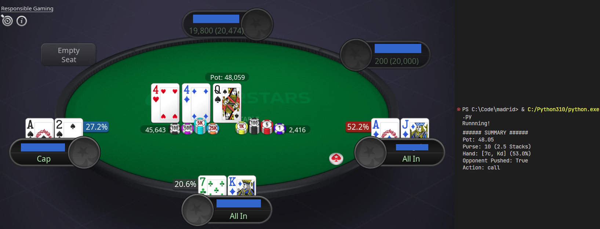

# :black_joker: Poker Stars - Tempest Bot

This is a bot that plays Tempest (aka Push/Fold) poker using OCR and image matching. Push/Fold poker is pretty simple, you are dealt 2 cards and you only have 2 options push(all in) or fold.

The app then uses precalculated Nash push/fold tables to recommend a action(push/fold). Also I precalculated the hand win % in a seperate table to also pull in and give you a bit more info about your hand.

Heres some useful reading for more details:

- [PokerStars Tempest](https://www.pokerstars.com/poker/games/tempest/)
- [Nash Push/Fold Tables](https://matchpoker.com/learn/strategy-guides/push-fold-charts)

## How it works

Heres a simple run down of how it works:

1. Keep scanning the center bottom player postion for new cards.
2. Once new cards appear read the suit and value of both cards.
3. Wait for your turn, by looking for the timer bar to appear below your profile picture.
4. Read the pot value and see if any other players have pushed in.
5. Fetch the Nash recommendation and hand win % from DB.
6. Print all your hand information and recommendation to the console.
7. Repeat.

## :microscope: Installation

Installation is 3 basic steps first install all the reqs:

    pip install -r requirements.txt

Next you will need to install Tesseract-OCR:

[Tesseract Download/Install Guide](https://github.com/UB-Mannheim/tesseract/wiki)

Lastly after tesseract is installed you will need to update the _ocr.pytesseract.tesseract_cmd_ in _vision.py_ file with the installation path of tesseract.

## :shaved_ice: Setup + Configuration

All configurations can be fonud in the _config.py_ file. The big setup challenge will be getting the positions setup for the player. I was using a 2k screen and the game board was snapped to he left using the Windows tile manager and thats how I calculated where everything is. Also your small blind and max push value can be set here also.

In the _vision.py_ file I have a _popup_image_ function that will show any screenshot you pass it so you can use that norrow in your X/Y positions of everything.

## :ramen: License + Legal

This project is provided as is, and is intended for educational purposes only and should not be used to actual gambling.

## :postbox: Contact & Support

Created by [Wyatt Ferguson](https://twitter.com/wyattxdev)

For any questions or comments you can send them to me on my socials:
### :shaved_ice: Follow on [Mastodon @wyattxdev@mastodon.social](@wyattxdev@mastodon.social)
### :tropical_drink: Follow on [Twitter @wyattxdev](https://twitter.com/wyattxdev)

If you find this useful and want to tip me a little coffee money:
### :coffee: [Buy Me A Coffee](https://www.buymeacoffee.com/wyattferguson)
